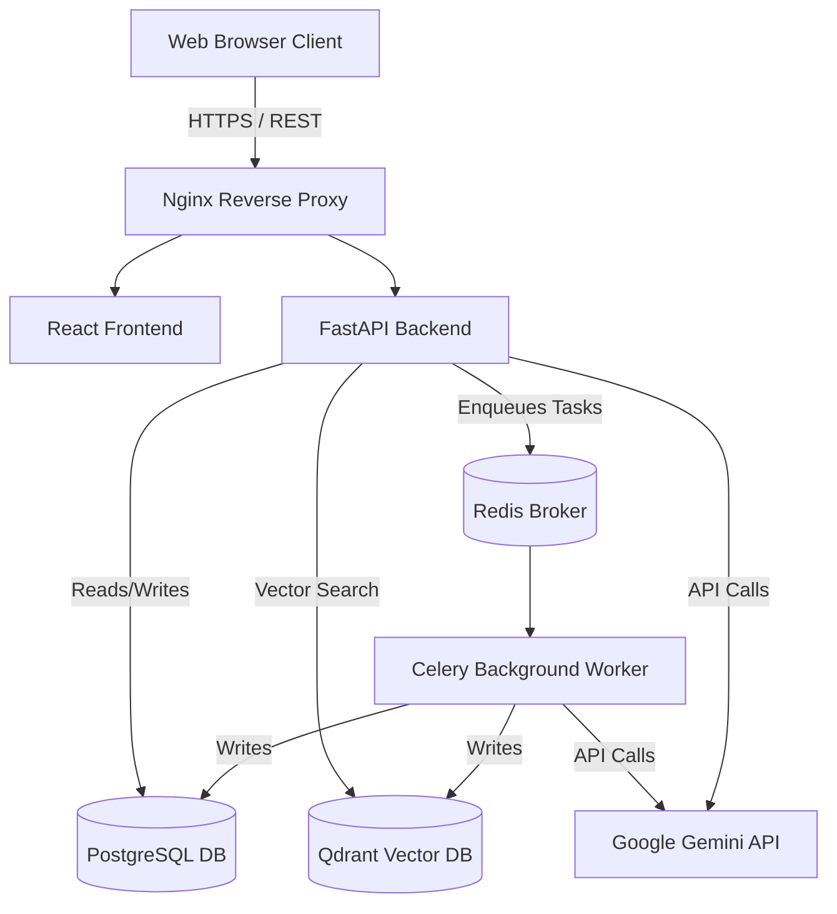

# NEXO — Enterprise AI Knowledge Platform System Design

## 1. System Overview
NEXO is a comprehensive Enterprise AI Knowledge Platform designed for industrial intelligence. It enables organizations to upload complex documents (like maintenance manuals, ISO standards, and safety reports), index them using modern NLP techniques, and query them through advanced RAG (Retrieval-Augmented Generation) pipelines. 

Beyond simple chat, NEXO extracts structured entities and relationships to build an Interactive Knowledge Graph and allows for visual automation of AI processing pipelines.

---

## 2. Architecture Diagram (Conceptual)

---

## 3. Technology Stack

### Frontend (Client-Side)
- **Framework:** React 19 with TypeScript, built using Vite.
- **Styling:** TailwindCSS for utility-first styling and a custom CSS variable-based design system.
- **State Management:** Zustand for global lightweight state management.
- **Data Visualization:** Recharts for analytics dashboards, ReactFlow for visual node-based AI workflows, and Force Graph for the Knowledge Explorer.
- **Authentication:** Clerk React SDK for enterprise-grade authentication.

### Backend (Server-Side)
- **Framework:** FastAPI (Python 3.12+) for high-performance, asynchronous REST APIs.
- **ORM:** SQLAlchemy (Async) with Alembic for database migrations.
- **Task Queue:** Celery for asynchronous background jobs (document processing, OCR, embedding).
- **Message Broker:** Redis, acting as both the Celery broker and result backend.

### Data Storage & Databases
- **Relational DB:** PostgreSQL. Stores users, workspaces, document metadata, knowledge graph nodes/edges, search logs, and AI workflow configurations.
- **Vector DB:** Qdrant. Stores high-dimensional document chunk embeddings for extremely fast semantic similarity search.
- **Blob Storage:** Local storage provider (configurable to S3/GCS in production) for raw PDF and DOCX files.

### AI & Machine Learning
- **LLM Provider:** Google Gemini API (defaulting to `gemini-2.5-flash`). Used for reasoning, RAG response generation, and structured graph entity extraction.
- **Embeddings:** FastEmbed (local computation) or via Gemini Provider for generating semantic vectors from document chunks.
- **Processing pipeline:** `pypdf` for text extraction, chunking algorithms for splitting context, and dynamic prompting for entity extraction.

---

## 4. Core Modules & Data Flow

### 4.1 Document Ingestion & RAG Pipeline
1. **Upload:** User uploads a PDF via the frontend. 
2. **API Receipt:** FastAPI validates the file size, type, and security policies, saves it to storage, and writes an `UPLOADED` record to Postgres.
3. **Queueing:** A background task is dispatched to Celery via Redis.
4. **Processing (Worker):**
   - **Text Extraction:** `pypdf` reads the raw bytes (with a fallback to raw text parsing for resilience).
   - **Chunking:** Text is broken down into manageable, overlapping chunks.
   - **Embedding:** Chunks are converted into vector embeddings.
   - **Indexing:** Embeddings are written to Qdrant; metadata is updated in Postgres.
   - **Graph Extraction:** The AI extracts entities (Equipment, Risks, Persons) and relationships, saving them to Postgres.
5. **Completion:** Document status is marked as `READY`.

### 4.2 AI Chat & Reasoning (RAG)
1. **Query:** User submits a question in the AI Chat.
2. **Intent Analysis:** A Reasoning Agent determines if the query requires a DB lookup, semantic search, or general conversation.
3. **Retrieval:** The backend converts the query to an embedding, searches Qdrant for the top-$K$ most relevant document chunks.
4. **Synthesis:** The retrieved chunks are injected into a strict system prompt. The LLM (Gemini) generates an answer with inline citations.
5. **Logging:** The query, latency, confidence score, and citations are logged for the Analytics Dashboard.

### 4.3 Knowledge Explorer (Knowledge Graph)
- Extracted entities are stored in `knowledge_nodes` and `knowledge_edges` tables in PostgreSQL.
- The `/graph` API endpoint queries these tables and formats them into a node-link structure.
- The frontend renders an interactive 2D Force-Directed Graph, enabling users to visually explore the relationships between equipment, documents, and incidents.

### 4.4 AI Workflow Automation
- A visual node-based pipeline builder using ReactFlow.
- Users can define custom extraction, OCR, or compliance scan pipelines.
- Workflows are saved as `WorkflowTemplate` JSON payloads in Postgres and can be triggered on document upload or on a schedule.

### 4.5 Analytics & Observability
- Dashboards utilize aggregate queries on the `search_logs` and `documents` tables to display Activity Trends, Latency vs Accuracy, and top query keywords.
- System health checks monitor the connections to Postgres, Qdrant, Redis, and the LLM provider.

---

## 5. Security & Authentication
- **Identity Provider:** Clerk handles user registration, login, and JWT generation.
- **API Protection:** FastAPI dependency injection (`CurrentUser`) verifies the JWT signature on every protected route.
- **Workspace Isolation:** Multi-tenant architecture. Every database query explicitly filters by `workspace_id` to ensure absolute data isolation between different corporate accounts.
- **Rate Limiting:** IP-based and User-based rate limiting on sensitive endpoints (like document uploads and LLM chats).

---

## 6. Infrastructure & Deployment
- **Containerization:** The entire stack is containerized using Docker.
- **Orchestration:** `docker-compose` is used to spin up the Frontend, API, Celery Worker, PostgreSQL, Qdrant, and Redis simultaneously.
- **Reverse Proxy:** Nginx routes traffic to the frontend static files and proxies `/api` requests to the FastAPI backend, handling CORS and SSL termination in production.
