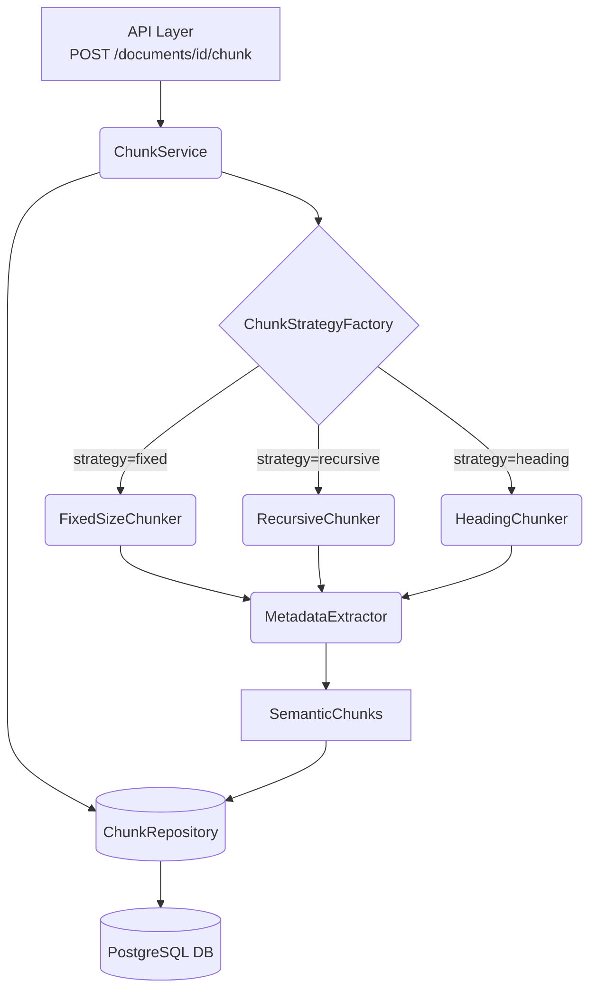
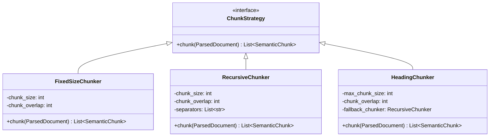

# Semantic Chunking Engine Architecture

## Purpose
The Semantic Chunking Engine (Milestone 3B) converts parsed documents into high-quality semantic chunks. These chunks preserve structural metadata (such as page numbers, section headings, and estimated reading time) to enable accurate vector embeddings and Retrieval-Augmented Generation (RAG).

## Architecture Diagram

## Strategy Pattern Flow

## Processing Flow
1. **API Invocation**: A request arrives at `/documents/{id}/chunk`.
2. **Document Retrieval**: The API loads the parsed document representation.
3. **Strategy Selection**: The `ChunkService` uses the `ChunkStrategyFactory` to instantiate the correct strategy.
4. **Chunk Generation**: The selected strategy splits the text into pieces, ensuring overlap constraints are met.
5. **Metadata Enrichment**: Each piece is passed to the `MetadataExtractor` which calculates tokens, characters, and structural metadata.
6. **Persistence**: The resulting `SemanticChunk` objects are saved to PostgreSQL via the `ChunkRepository`.
7. **Summary**: A processing summary (including estimated embedding costs) is calculated and returned to the client.

## Database Schema

**Table**: `chunks`
- `id` (UUID, Primary Key)
- `document_id` (UUID, Foreign Key -> `documents.id`)
- `chunk_index` (Integer)
- `text` (Text)
- `token_count` (Integer)
- `character_count` (Integer)
- `page_number` (Integer, Optional)
- `heading` (String, Optional)
- `metadata_json` (Text, Optional)

*Indexes*: `document_id`, `chunk_index`

## Future Improvements
- Tokenizer precision: Integrate `tiktoken` to perfectly align token count with specific LLM embedding models (e.g. OpenAI's `text-embedding-ada-002`).
- Asynchronous Chunking: Shift chunking logic entirely to the Celery worker for massive documents.
- Advanced Heading Sub-chunking: Better recursive strategies for multi-level nested headers.
