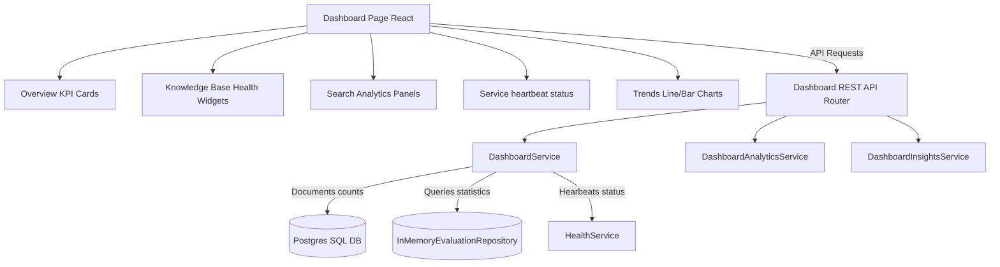

# ForgeMind Executive Dashboard Architecture

This document outlines the architecture, data flow, API contracts, and frontend presentation models for the ForgeMind Knowledge Intelligence Dashboard.

## Architecture & Data Flow



1. **Dashboard UI**: Requests components telemetry asynchronously when mounting.
2. **DashboardService**: Aggregates metadata statistics (like file counts, pending uploads, failed indexings) from PostgreSQL tables, chunks registries, and memory heartbeat histories.
3. **DashboardAnalyticsService**: Group statistics by day to compile chronological line & bar trends for the visual charting components.
4. **DashboardInsightsService**: Flags configuration warnings (like ingestion error jobs or latency increments) as smart telemetry warnings.

---

## API Contracts

### 1. `GET /api/v1/dashboard/overview`
Returns general metrics:
```json
{
  "total_documents": 12,
  "indexed_documents": 10,
  "pending_documents": 1,
  "failed_documents": 1,
  "total_chunks": 142,
  "total_vectors": 1420,
  "total_conversations": 4,
  "questions_today": 3,
  "average_confidence": 0.88,
  "average_latency": 124.5,
  "average_retrieval_score": 0.91
}
```

### 2. `GET /api/v1/dashboard/knowledge`
Returns document quality rankings:
```json
{
  "most_referenced_documents": [],
  "least_used_documents": [],
  "documents_missing_metadata": [],
  "low_confidence_documents": [],
  "failed_processing_jobs": [],
  "largest_documents": [],
  "newest_documents": []
}
```

### 3. `GET /api/v1/dashboard/search`
Returns query metrics:
```json
{
  "most_frequent_queries": [],
  "top_keywords": [],
  "average_query_length": 24.5,
  "retrieval_success_rate": 0.95,
  "average_similarity": 0.88,
  "average_citation_count": 2.4
}
```

### 4. `GET /api/v1/dashboard/system`
Returns heartbeat statuses:
```json
{
  "embedding_provider": "FastEmbedProvider",
  "llm_provider": "OpenAIChatProvider",
  "vector_store": "QdrantVectorStore",
  "retriever": "HybridRetriever",
  "evaluation_framework": "RAGAS/ForgeMind",
  "overall_system_health": "Healthy"
}
```

### 5. `GET /api/v1/dashboard/trends`
Returns time-series datapoints:
```json
{
  "daily_uploads": [],
  "daily_queries": [],
  "confidence_trend": [],
  "latency_trend": [],
  "document_growth": [],
  "vector_growth": []
}
```

---

## Frontend Components & Chart Configurations

- **DashboardOverview**: Displays general KPIs (documents, vectors, chat sessions).
- **KnowledgeHealthCard**: Provides progress bars for fully indexable documents.
- **SearchAnalyticsCard**: Lists token keywords frequencies and common searches.
- **SystemHealthCard**: Renders active service status indicators.
- **QuickActionsPanel**: Link buttons to invoke uploads, open AI chat sessions, or access settings.
- **Recharts Line & Bar charts**: Plots performance metrics.
