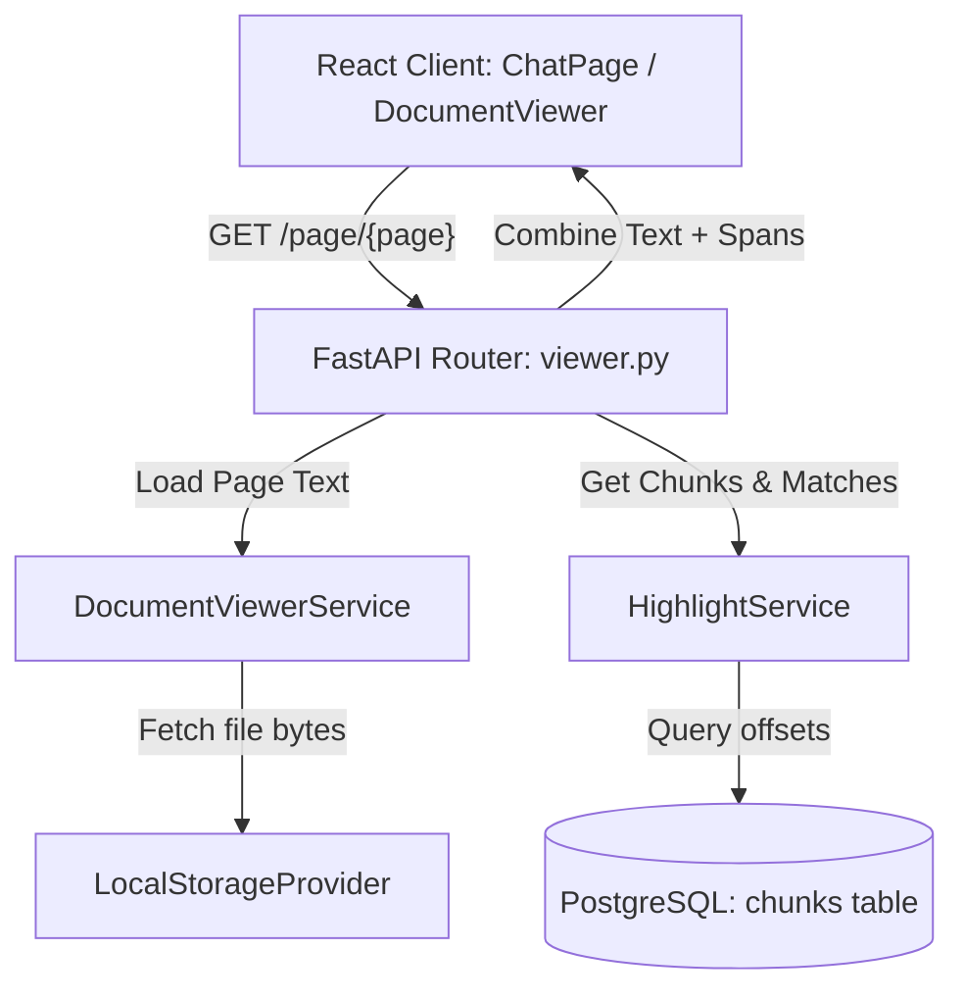

# Explainable Document Viewer Architecture

This document details the software design, sequence flows, character highlighting offsets, and explainability mapping behind the NEXO Executive Document Viewer (Milestone 6A).

---

## 1. System Topology & Data Flow

---

## 2. Telemetry & User Preferences Layer
All user UI settings are persisted locally in a centralized state store backed by `localStorage`:
- **Split Pane Width**: Keeps customized resizable columns layout bounds.
- **Zoom Level**: Persists zoom ratios between 50% to 200%.
- **Last Viewed Page**: Tracks current slide indexes per document ID.
- **Developer Mode**: Flags debug console outputs.

---

## 3. Highlighting and Character Mapping Offset Strategy
To guarantee precise highlighting inside extracted PDF and Word texts:
1. **Source Records Ingestion**: Chunks are stored in PostgreSQL with their corresponding `document_id` and `page_number`.
2. **Text Normalization**: When a page is requested, the backend runs string matching using substring indexes:
   `page_text.lower().find(chunk_text[:40].lower())`
3. **Offset Generation**: The starting and ending string boundary coordinates are sent to the client as:
   - `start_offset`: Integer index start.
   - `end_offset`: Integer index end.
4. **Interactive Highlighting**: The frontend tokenizes the page text on index offsets boundaries to render highlighted `<mark>` segments in the DOM with hoverable metric details.

---

## 4. Citation Resolution Sequence
- **Step 1**: User clicks on a citation badge in ChatPage.
- **Step 2**: The client calls `/documents/{id}/citation/{citation_id}` to retrieve the matching page index.
- **Step 3**: The viewer switches to the target page index and highlights the citation, automatically scrolling it into view.

---

## 5. Future OCR Ingestion Roadmap
To support scanned documents lacking raw digital texts:
- **Step 1**: Add Tesseract OCR parsing step in `document_worker.py`.
- **Step 2**: Store bounding boxes coordinates `(x1, y1, x2, y2)` for each word in PostgreSQL.
- **Step 3**: Overlay relative canvas boxes on top of the document canvas inside `PDFViewer.tsx`.
