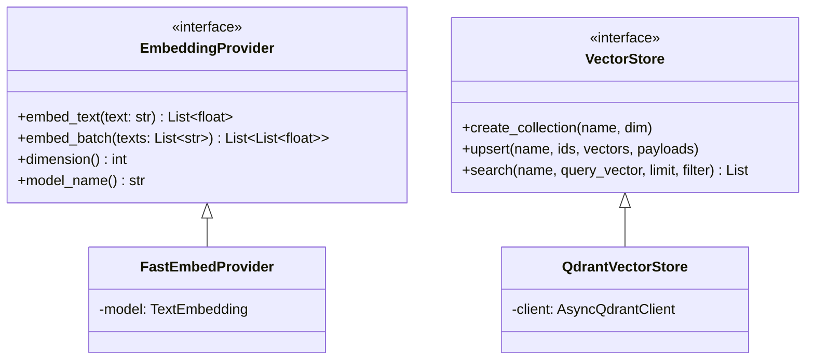
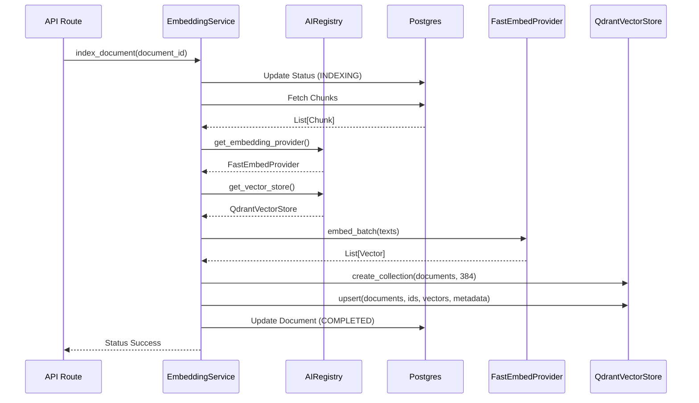

# Embedding Pipeline Architecture (Milestone 3C)

## Overview

The Vector Embedding Pipeline takes semantic chunks of documents and converts them into dense vectors for similarity search. It uses a decoupled architecture adhering to the Dependency Inversion Principle, where the Core business logic (`EmbeddingService` and `SimilaritySearchService`) relies purely on abstract interfaces.

## Interfaces

## AI Component Registry

All AI components (Providers, Stores, Retrievers) are registered in a centralized singleton `AIRegistry` (`app.ai.registry.registry`). 
The registry reads configuration from `.env` (via `Settings`) to instantiate and resolve the requested providers.

## Execution Flow

## Future Expansion
Due to the interface-driven design, supporting `OpenAI` or `Pinecone` simply involves adding a new class that implements the base interface, then adding a configuration switch in `AIRegistry`. No changes to `EmbeddingService` are required.
