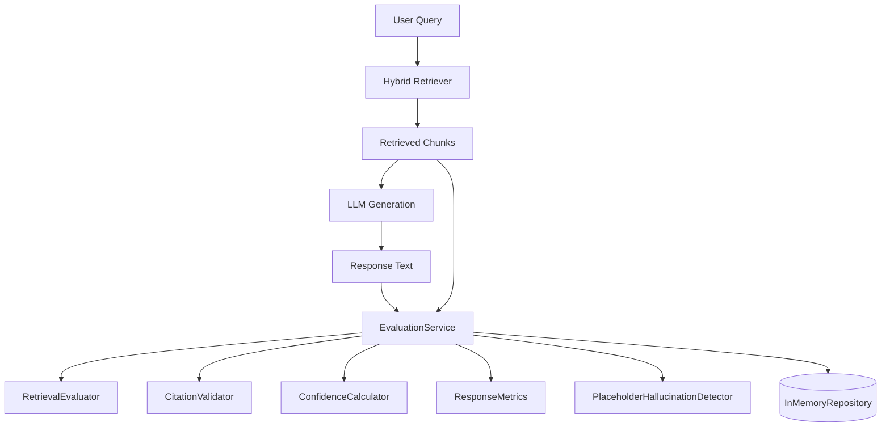
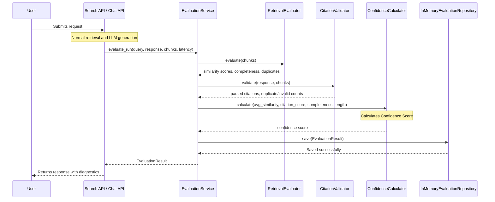

# AI Evaluation & Quality Framework (Milestone 5A.5)

## Overview
The AI Evaluation & Quality Framework allows tracking and profiling of retrieval and generation quality for ForgeMind AI. It scores RAG pipeline outputs using vector similarities, citation correctness, response length, and completeness indicators without altering generative logic.

## Architecture

## Sequence Execution Flow

## Metrics and Formulas

### 1. Retrieval Completeness
Evaluates the proportion of retrieved context chunks that meet a baseline relevance threshold:
$$\text{Completeness} = \frac{\text{Count}(\text{chunk} \mid \text{score}_{\text{chunk}} \ge \text{threshold})}{\text{Total Chunks}}$$
Where $\text{threshold} = 0.70$.

### 2. Citation Score
Measures citation validity matching:
$$\text{Citation Score} = \frac{\text{Count}(\text{Valid Citations})}{\text{Total Citations}}$$
A citation is **valid** if it parses successfully and resolves to a document and page actually present in the retrieved context chunks.

### 3. Confidence Score Formula
The total confidence index (scaled $0\text{--}100$) blends retrieval relevance and factual citation verification:
$$\text{Base Confidence} = 100 \cdot \left( w_{\text{sim}} \cdot \text{AvgSimilarity} + w_{\text{cite}} \cdot \text{CitationScore} + w_{\text{comp}} \cdot \text{Completeness} \right)$$
Where the default weights are:
- $w_{\text{sim}} = 0.40$ (Vector Similarity weight)
- $w_{\text{cite}} = 0.40$ (Citation accuracy weight)
- $w_{\text{comp}} = 0.20$ (Context completeness weight)

#### Penalties and Modifiers:
- **Short Response Penalty**: Subtracts $15.0$ if the character length is $< 20$ (indicates refusals or errors).
- **Hallucination Penalty**:
  - Subtracts $30.0$ if hallucination risk is `HIGH`.
  - Subtracts $15.0$ if hallucination risk is `MEDIUM`.

## Future Hallucination Detection
The `HallucinationDetector` interface is structured to support swapping the current heuristics-based `PlaceholderHallucinationDetector` with advanced algorithms:
1. **NLI Entailment**: Using a cross-encoder model to determine if the generated text is logically entailed by the retrieved context.
2. **LLM-as-a-judge**: Submitting the query, generated response, and context to a secondary, independent LLM model using chain-of-thought verification to check for ungrounded claims.
