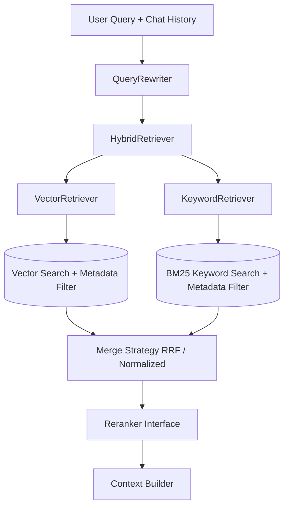
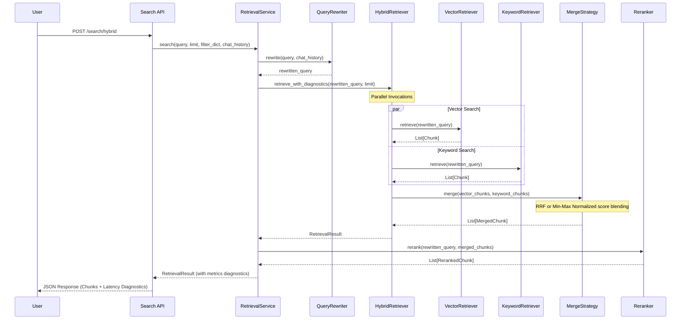

# Hybrid Retrieval Architecture (Milestone 5A)

## Overview

ForgeMind AI's retrieval engine combines the high-precision semantic capabilities of **Vector Search** with the exact term matching performance of **BM25 Keyword Search**. The hybrid pipeline merges, deduplicates, and normalizes candidate outputs before passing them to a **Reranking Engine** for high-fidelity cross-encoder ordering.

## High-Level Pipeline Flow

## Detailed Execution Sequence

## Algorithms and Strategies

### 1. Query Formulation (QueryRewriter)
- **Pronoun Resolution**: Resolves relative references (e.g., "it", "this document") using sliding message history.
- **Formulation**: Formulates standalone vector search-friendly questions.

### 2. Reciprocal Rank Fusion (RRF)
RRF blends rankings from vector and keyword search without relying on scale normalization:
$$\text{RRF\_Score}(d \in D) = \sum_{m \in M} \frac{1}{k + \text{rank}_m(d)}$$
Where $k = 60$ is the fusion constant, and $\text{rank}_m(d)$ is the 1-based rank of document $d$ in the output of method $m$.

### 3. Min-Max Weighted Score Normalization
Alternatively, scores can be normalized to the $[0, 1]$ range:
$$\text{Norm\_Score} = \frac{\text{score} - \text{min\_score}}{\text{max\_score} - \text{min\_score}}$$
And combined:
$$\text{Final\_Score} = \alpha \cdot \text{Norm\_Vector\_Score} + (1 - \alpha) \cdot \text{Norm\_Keyword\_Score}$$
Where $\alpha$ determines the vector search weight bias (default is 0.5).

## Future Providers
The architecture is provider-independent:
- **Vector Stores**: Supports extending Qdrant to Pinecone, Milvus, or pgvector.
- **Keyword Search**: Supports swapping BM25 Okapi with Elasticsearch or OpenSearch.
- **Rerankers**: Interfaces support replacing PlaceholderReranker with BAAI/bge-reranker or Cohere Rerank API.
