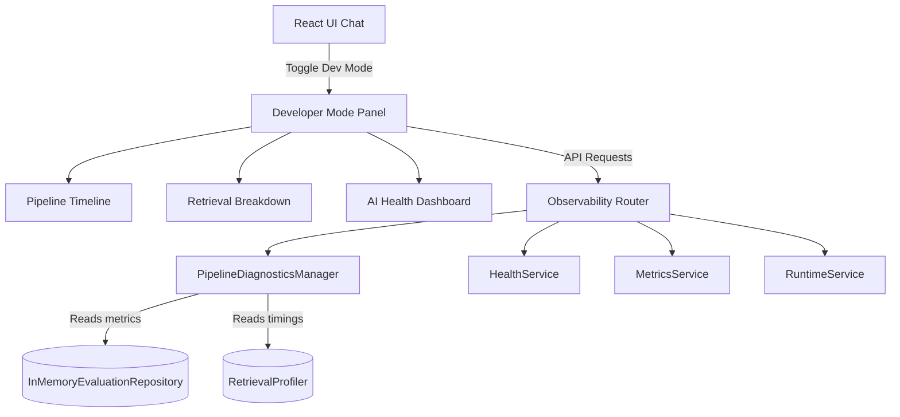
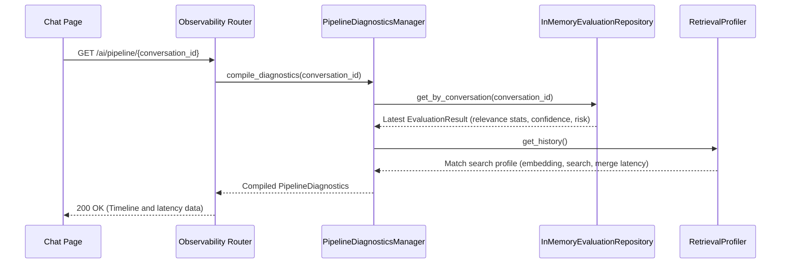

# AI Observability and Developer Mode (Milestone 5B)

## Overview
Milestone 5B introduces telemetry dashboards and step-by-step latency tracking for the RAG pipeline. Developer Mode allows real-time visualization of query processing details, retrieval profiles, source verification matching, and system stats.

## Architecture

## Sequence Execution Flow

## Metrics Definitions

| Metric | Category | Formula / Definition | Source |
| --- | --- | --- | --- |
| **Embedding Latency** | Timing | Duration (ms) taken to compute query vectors. | `RetrievalProfiler` |
| **Vector Search Latency** | Timing | Duration (ms) taken by Qdrant similarity searches. | `RetrievalProfiler` |
| **Keyword Search Latency** | Timing | Duration (ms) taken by BM25 search scans. | `RetrievalProfiler` |
| **Merge Latency** | Timing | Duration (ms) taken to execute RRF (Reciprocal Rank Fusion) ranking. | `RetrievalProfiler` |
| **Rerank Latency** | Timing | Duration (ms) taken by Cross-Encoder re-scores. | `RetrievalProfiler` |
| **Confidence Index** | Quality | Blended score of similarity bounds, citation count, and length. | `EvaluationResult` |
| **Hallucination Risk** | Quality | Classification (LOW/MEDIUM/HIGH) based on reference mismatches. | `EvaluationResult` |
| **Percentile Latency (P95)** | System | 95th percentile latency of active RAG requests. | `MetricsService` |
| **Documents Indexed** | System | Total document count loaded in PostgreSQL database. | `RuntimeService` |
| **Vectors Stored** | System | Total vector chunks saved in Chunk table / Qdrant. | `RuntimeService` |

## Developer Mode Dashboard Overview
When Developer Mode is enabled on the React chat interface, a collapsible dashboard is mounted side-by-side with the chat history. This hub renders:
1. **AI Health Panel**: Real-time heartbeats for embedding APIs, vector store services, LLMs, and evaluation registries.
2. **Pipeline Timeline**: Visual tracking highlighting timings (Query -> Embed -> Search -> Merge -> Rerank -> Prompt -> LLM -> Eval -> Stream).
3. **Retrieval Breakdown**: Interactive chart comparing dense Vector similarities vs BM25 Keyword matches.
4. **Citation Grounding**: Verified document mappings flagging ungrounded claims.
