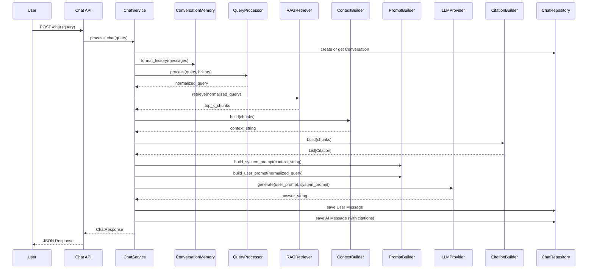

# RAG Pipeline Architecture (Milestone 4A)

## Overview

The Retrieval-Augmented Generation (RAG) orchestration layer manages the flow of user queries through document retrieval and AI text generation, culminating in a response formatted with citations. It implements the "Chat" capabilities of ForgeMind AI.

## Flow of Data

## LLM Providers
Supported Providers via `LLMProvider` interface in `app/ai/interfaces.py`:
- `OpenAIProvider`: Calls OpenAI models.
- `GeminiProvider`: Calls Google Gemini models.
- `OllamaProvider`: Placeholder for future local LLMs.
Providers are centrally managed and instantiated by the `AIRegistry` singleton based on the `.env` configuration (`LLM_PROVIDER`).

## Streaming
Responses can optionally be streamed via Server-Sent Events (SSE) using the `/chat/stream` endpoint, mapping closely to the standard logic flow but returning an `AsyncGenerator` instead.
